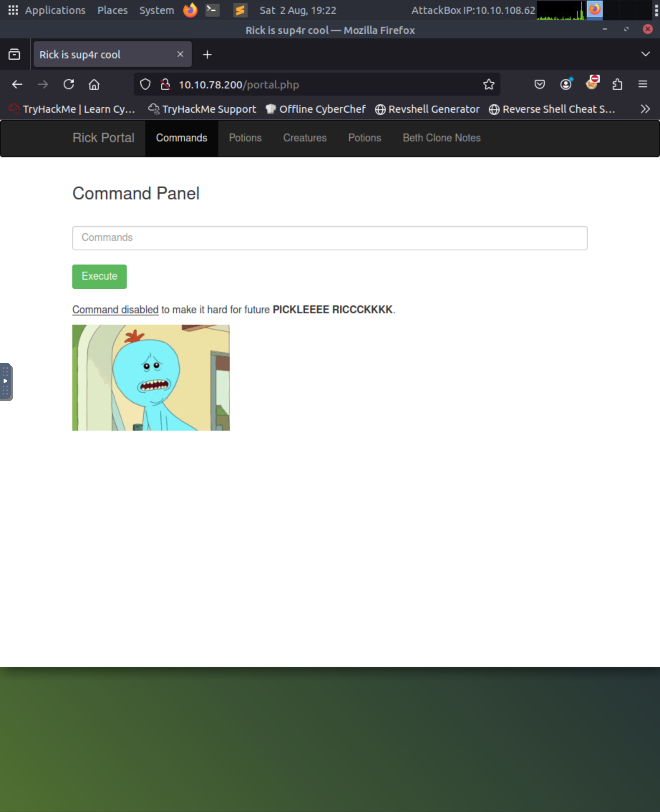
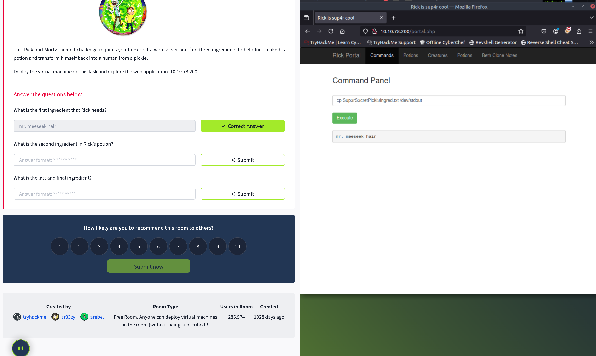

# TryHackMe - Pickle Rick

This was a fun and simple web challenge on TryHackMe where our goal was to help Rick turn back into a human by finding **3 ingredients** hidden in a vulnerable website.

---

## Step 1: Exploring the Site

Visited `http://10.10.78.200` — a Rick-themed portal on an attackbox

---

## Step 2: View Page Source

As a Web Developer myself, I have a habit of inspecting the console and checking the page source. When I checked the page source I got the username of RICK.

## Step 3: Obtain Password

Since this was an empty or almost empty site, I searched for robots.txt file where the pages the developers can/can't access are written. From there I got the password.

## Step 4: Login

Since we obtained the username and the password, I needed to find the login page. As I mentioned that I am a web developer, I tried "/login" but it did not work, then I tried with php. Suddenly a login page appeared where I logged in and obtained access to the portal.

## Step 5: Portal & First Ingredient

When I got access to a portal, by inputting the command "ls" we can see all the files that are in the current folder we're in. A text file called Sup3rPickl3Ingred.txt is listed in it. But when I tried to view it using cat command, it didn't work, I did a bit of research and used the cp command to obtain the contents in the standard output. So, by using the commands, we can find the 1st ingredient that Rick needs.

## Step 6: Finding Clues

I also saw another file called "clue.txt" which, as the name suggests, could give us some clues as to where the other ingredients are. When I opened the file, it showed that "Look around the file system"

## Step 7: Exploring the File System

As I am an average Arch Linux user, one of the most important directories to check for important files is the /home directory to reveal certain users and possibly files inside their sub-directory. I ran the "ls /home" command we see two directories belonging to users — rick and ubuntu.

## Step 8: Second Ingredient

I know that the "ubuntu" directory seems like a default directory on the Linux system itself but the "rick" directory is most certainly a configured user. I proceeded to list the contents of the "/home/rick" directory via "ls /home/rick" it reveals an interesting file.

So, by reading the contents of this file with "tac /home/rick/second\ ingredients" we get the 2nd ingredient Rick needs!
P.S. the cat command won't work, so I had to do the digging for alternative commands

## Step 9: Third Ingredient (Root Directory)

For the Final Flag, I didn't have any clues where it was, so I assumed it's the "root directory", which will demand us to escalate privileges to become the root user. Then I proceeded to list the contents using the "sudo ls /root/" which gave the final clue file. I just read the contents of the file using "sudo tac /root/3rd.txt"

## Summary

This TryHackMe challenge demonstrated essential penetration testing skills through a Rick and Morty themed web exploitation scenario.

**Key Skills Learned:**

- **Web Enumeration**: Source code inspection, robots.txt analysis, and directory discovery
- **Linux Navigation**: File system exploration and command-line proficiency
- **Problem Solving**: Using alternative commands (cp, tac) when standard tools were restricted
- **Privilege Escalation**: Leveraging sudo to access restricted directories

**Methodology Applied:**

1. Information gathering through web reconnaissance
2. Credential discovery via common files (robots.txt, source code)
3. System exploration using Linux commands
4. Adaptive problem-solving when facing command restrictions

This hands-on exercise reinforced the importance of systematic enumeration and persistence in cybersecurity assessments. Successfully retrieved all three ingredients by combining web application testing with Linux system administration skills.
