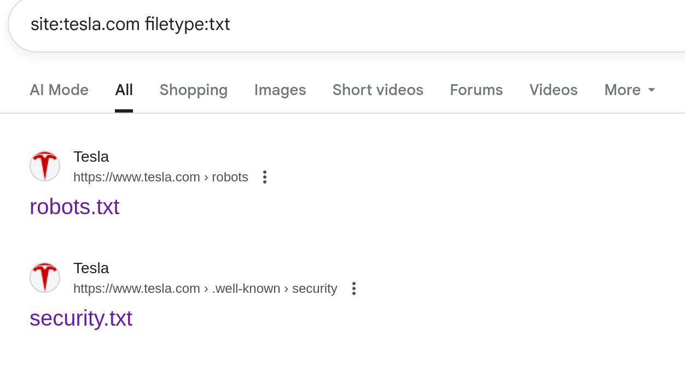

# Discovering Sensitive Files Through Google Dorking: A Practical Insight

While casually exploring publicly available resources through Google Search, I came across some interesting `.txt` files hosted under a well-known domain using the query:

```makefile
site:tesla.com filetype:txt
```

This simple yet powerful **Google Dork** reveals publicly accessible `.txt` files hosted on the Tesla domain. Among the files discovered were:

- `robots.txt` – instructs web crawlers what to index
- `security.txt` – provides security contact information for reporting vulnerabilities

  
Fig 1: Files discovered via Google Dorking the Tesla Website

## 1. robots.txt – Indexing Instructions

The `robots.txt` file is found at the root of most websites (e.g., `https://www.tesla.com/robots.txt`). It provides indexing rules for search engine crawlers.

Upon reviewing the contents of the `robots.txt` file, several observations were made:

### Allowed Resources

The file explicitly **allows** indexing of frontend assets such as:

- CSS and JavaScript files (e.g., `/misc/*.css`, `/modules/*.js`)
- Image files (`*.jpg`, `*.jpeg`, `*.gif`, `*.png`)
- Select public directories (`/themes/`, `/profiles/`)

These allowances help search engines render the website properly in search results and previews.

### Disallowed Resources

More importantly, the file **disallows access to several critical internal paths and files**, including:

- System directories like `/includes/`, `/scripts/`, and `/modules/`
- Installation and changelog files such as:
  - `/INSTALL.mysql.txt`
  - `/INSTALL.pgsql.txt`
  - `/CHANGELOG.txt`
  - `/cron.php`

> Note: Disallowing files in `robots.txt` only prevents them from being indexed by well-behaved search engines — it does **not** restrict direct access to them.

  
Fig 1: `robots.txt` content discovered via Google Dorking

## 2. security.txt – Responsible Disclosure Policy

The `security.txt` file is a modern web standard defined in RFC 9116 (`https://www.rfc-editor.org/rfc/rfc9116.html`), designed to provide a **clear and accessible channel for security researchers and ethical hackers to report vulnerabilities** found in a domain.

### What is security.txt

Here it was placed at:

```bash
https://tesla.com/.well-known/security.txt
```

This file acts like a digital "security notice board" for a website, containing contact information and relevant policies. It ensures that security researchers know **how to reach the right people** in the organization securely and responsibly.

### Typical Contents Include

- **Contact:** The email address or URL for reporting vulnerabilities.
- **Encryption:** A link to a public PGP key to encrypt messages securely
- **Acknowledgments:** A URL or message specifying how researchers will be credited or rewarded
- **Policy:** A link to the organization's vulnerability disclosure or bug bounty policy
- **Expires:** A date after which the file is considered invalid

  
Fig 1: `security.txt` content discovered via Google Dorking

---

## Security Reflection

While files like `robots.txt` and `security.txt` are intended for transparency and responsible indexing/disclosure:

- **robots.txt can unintentionally reveal internal structure** to attackers
- **security.txt builds trust** with ethical hackers and establishes a framework for responsible communication

However, both files should be managed with care and should **not substitute real security mechanisms** like access control, input validation, or encryption.

---

## Best Practices for Web Security

- **Never rely on `robots.txt` for security** — it's not an access control tool
- **Protect sensitive directories with authentication**
- **Regularly audit public files and directories**
- **Monitor your domain for what's indexed** using Google Search Console
- **Keep `security.txt` up to date**, with valid contact and encryption details
- **Use HTTPS** to ensure your `security.txt` (and other sensitive files) are securely transmitted

---

## Conclusion

What began as a casual search led to a valuable insight into how files like `robots.txt` and `security.txt` — though seemingly harmless — can assist attackers or ethical hackers during reconnaissance.

Public files should always be treated as **globally visible**, and true security must be enforced at the server and application levels. At the same time, files like `security.txt` can build trust and create a responsible pathway for vulnerability disclosure — provided they are configured and maintained correctly.
