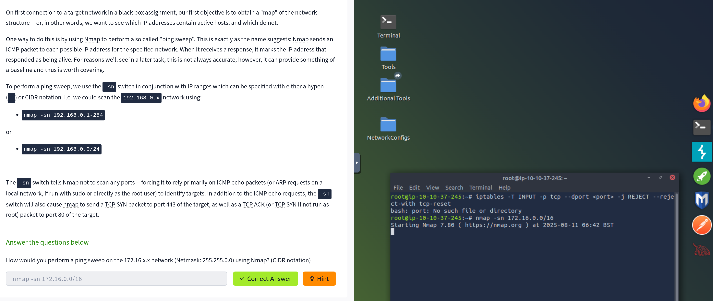

# FurtherNmap Room TryHackMe

## 1. Getting Started — Deployment & Setup

I kicked things off by deploying the provided VM (no need to authenticate or exploit it)—the platform automatically stood it up, and I grabbed the target IP. Then, I switched to the AttackBox environment to have Nmap ready for action.

## 2. Introduction & Why Enumeration Matters

The room’s intro reminded me that **enumeration is everything**—knowing what services are up gives you the strategic advantage before you even think about exploitation. A target might be hosting a web service, or it could be something like a Windows AD controller. Ports direct that traffic, making them the key to reconnaissance. There are **65,535 ports** in total, with the first **1,024 being the "well-known" ports** to focus on initially.

## 3. Nmap Switches & Core Scan Options

Here’s what I learned while digging through `nmap -h` and the room content:

- **`-sS`** — SYN (half-open / stealth) scan  
- **`-sU`** — UDP scan  
- **`-O`** — Operating System detection  
- **`-sV`** — Service version detection  
- **`-v`, `-vv`** — Increase verbosity levels  
- **`-oA`, `-oN`, `-oG`** — Save output in all formats, normal format, or grepable format, respectively  
- **`-A`** — Aggressive mode (enables OS, version detection, scripts + traceroute)  
- **`-T5`** — Timing template level 5 (fast, noisy)  
- **`-p-`** — Scan all ports  
- **`--script`** and **`--script=vuln`** — Run single or all scripts in the “vuln” category  \

## 4. Deep Dive: Scan Types & Behaviors

- For closed ports, the server responds with an **RST**, per RFC 793.  
- SYN scans are stealthy (“half-open”) scans; they **require elevated privileges** (e.g., sudo).  
- For UDP scans: if no response is seen, Nmap reports **open|filtered** because it can't determine the exact state. Closed UDP ports usually trigger an ICMP “port unreachable.”  
- **NULL, FIN, Xmas scans** are stealth techniques designed for firewall evasion. They set unusual TCP flag combinations and are useful on **Windows hosts**, which tend to reply with RST to all ports.  
- To sweep subnets, something like `nmap -sn 172.16.0.0/16` lets Nmap ping-sweep the network.  

1[aboutxmas](assets/about-xmas.png)

## 5. Nmap Scripting Engine (NSE)

- NSE scripts are written in **Lua**.  
- Scripts tagged “intrusive” are risky to run in production.  
- The `ftp-anon.nse` script accepts an optional `maxlist` argument.  
- `smb-os-discovery.nse` helps fingerprint the SMB server’s OS, but it **depends on** `smb-brute`.  

## 6. Firewall Evasion Tactics

- Use `-Pn` to skip ping checks—useful when ICMP is blocked.  
- With `--data-length`, you can append random bytes to packets, which helps bypass simple packet filters.

## 7. Practical Scan Results — Putting It All Together

In the final “Practice” section, I tried:

- A **ping check** (using `ping <IP>`) confirmed the VM is alive.

- A **Xmas scan** (`nmap -sX -Pn <IP>`) over the first 999 ports showed all as **open**—since there was no response, Nmap labeled them open/filtered.

- A **verbose SYN scan** (`nmap -vv -Pn <IP>`) and a more broad **SYN scan** (`nmap -sS -Pn <IP>`) revealed **5 open ports** among the first 5,000.  

## 8. Wrap Up & Reflection

Overall, this room was a slick dive into Nmap’s advanced scanning methods, script features, and firewall evasion tactics. Working hands-on with these tools really solidified the concepts.
