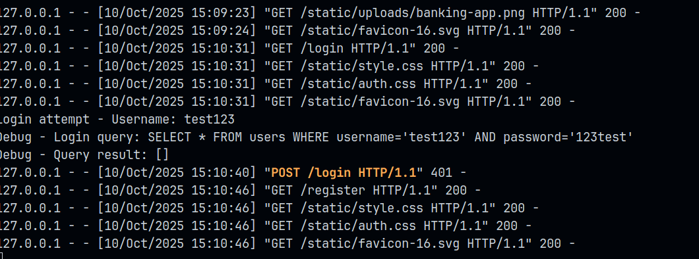
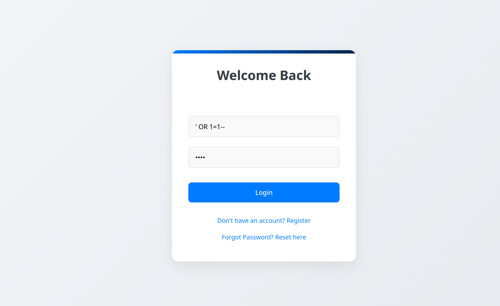

# Vulnerability Report — SQL Injection (Authentication Bypass → Unauthorized Admin Action)

**Date:** 2025-10-10  
**Target:** `POST /login` (authentication endpoint) → Admin loan management UI  
**Severity:** **Critical**

---

## Summary

I logged in as a normal user and submitted a loan request. During a subsequent login attempt I exploited a SQL injection vulnerability in the authentication flow to bypass authentication, gained an administrative session, and used that session to approve the pending loan. I then returned to the original user view and confirmed the loan was approved.

This report documents the sequence, impact, root cause, and evidence. Reproduction details and exploit payloads are intentionally omitted — only authorized personnel should reproduce this in a controlled testing environment.

---

## Key timeline (reconstructed)

1. Logged in as a regular user and submitted a loan request (user view).
2. Performed an authentication attempt with crafted input that exploited SQL injection at the `POST /login` endpoint.
3. Successfully authenticated as an administrative account (authentication bypass).
4. Approved the pending loan from the admin UI.
5. Logged back in as the original user and confirmed the loan status was **approved**.

---

## Impact

- **Full account impersonation** (including administrative privileges).
- **Unauthorized financial action:** approving a loan without proper authorization.
- **Data integrity risk:** business-critical records were modified by an unauthorized actor.
- **Confidentiality & regulatory risk:** potential exposure or unauthorized modification of user financial data.
- **Business risk:** potential fraudulent approvals, financial loss, and reputational damage.

---

## Root cause

The authentication logic constructs SQL queries by concatenating raw user input into SQL strings (string concatenation), allowing an attacker to modify query logic via SQL injection. Password checks are performed in a way that allows malicious input to alter the WHERE clause and bypass authentication entirely. The application also logs raw input in server logs (including data used in the injection), increasing forensic risk.

---

## Evidence (screenshots)

> **Note:** Image paths reference files provided during the assessment. If you want the images embedded into this markdown file, ensure these files are available alongside the markdown file at the referenced paths.

1. **Login attempt & server log**  
   Shows server constructing and running a concatenated SQL query for authentication (raw user input visible in the log).
   
   
   
   *Caption:* Server logs showing the `SELECT * FROM users WHERE username='...' AND password='...'` pattern and the login attempt.

2. **Login form (injection input visible)**  
   Screenshot of the login UI showing the input used during the test.

   
   *Caption:* Login form with the test input used during the assessment.

3. **Admin UI — Pending Loan Applications (post-approval)**  
   Shows the pending loan list with the loan shown as approved after the admin action.

   
   *Caption:* Admin interface showing the loan entry and evidence of an “Approve” action (post-exploitation result).  

4. Result
   
   *Caption:* The user account showing that the loan amount is credited.
---

## Immediate actions (recommended, short)

1. **Invalidate admin sessions** immediately (force logout) and block the compromised session(s).  
2. **Preserve logs** and system state for forensic review — do not restart or clear relevant services until logs are archived.  
3. **Rotate database credentials** and ensure application DB accounts use least-privilege.  
4. **Block the login endpoint** with a temporary WAF rule or maintenance page until a patch is deployed.  
5. **Revoke / audit** the approved loan and any other admin actions performed during the compromise window.  
6. Notify stakeholders and legal/compliance teams as required by internal incident response procedures.

---

## Short-term code fixes (must implement)

1. **Stop building SQL queries via string concatenation.** Use parameterized queries / prepared statements for all database access.  
2. **Do not store or compare plaintext passwords in SQL.** Store only strong salted password hashes (e.g., bcrypt or Argon2). Authenticate by selecting the user record by username and then verifying the hash in application code.  
3. **Sanitize and validate inputs** at the application boundary; enforce strict server-side input validation.  
4. **Reduce logging of sensitive data.** Never log raw passwords or injection test inputs in production logs.

---

## Long-term recommendations

- Enforce **least-privilege** for all DB accounts used by the application.  
- Add **SAST** tools to CI pipelines and schedule regular **DAST** and manual penetration tests focused on authentication and business logic.  
- Introduce **MFA for admin accounts** and sensitive operations (approval workflows).  
- Add **anomaly detection and alerts** for unusual admin actions (e.g., approvals performed after abnormal logins, logins from new IPs, or bulk approvals).  
- Implement **change control and approval workflows** for critical business actions (e.g., require multi-person approval for high-risk financial transactions).  
- Harden logging and monitoring — log enough for forensics but filter/obfuscate sensitive inputs.

---

## Verification plan

1. Patch the codebase to use parameterized queries and hashed-password verification.  
2. Deploy changes to a staging environment and run automated **DAST** and unit tests that assert injection strings cannot bypass authentication.  
3. Perform an authorized, manual retest in a controlled environment (approved by security leads) to validate the fix.  
4. Monitor production logs for anomalous admin actions and failed/suspicious login attempts following deployment.  
5. Conduct a post-mortem and update incident response and secure coding guidelines.