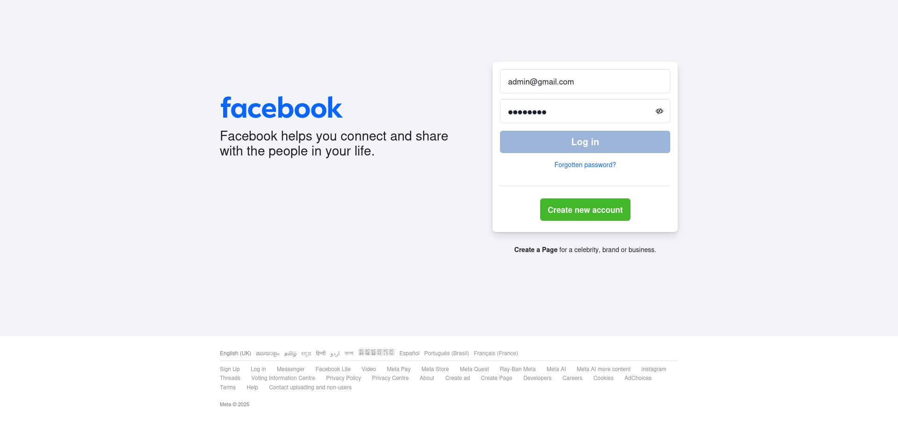
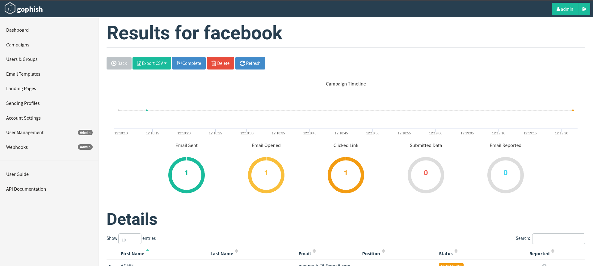

# Simulated Phishing Campaign — Task 6

**Author:** DILSHAD AHAMMED  
**Date:** 10/03/2025
**Tool:** Gophish ([https://getgophish.com/](https://getgophish.com/))  
**Documentation referenced:** [https://docs.getgophish.com/user-guide/building-your-first-campaign](https://docs.getgophish.com/user-guide/building-your-first-campaign)

---

## 1. Objective

Perform a simulated phishing campaign in a controlled VM environment to evaluate the process of building, launching, and analyzing a phishing campaign using Gophish. Produce a short report with screenshots, findings, and recommendations.

---

## 2. Environment

* **Host OS:** Windows
* **VM guest OS:** Kali Linux
* **Gophish version:** (omitted as requested)
* **Network configuration:** (omitted as requested)
* **SMTP used for sending:** Gmail SMTP

---

## 3. Campaign setup (steps performed)

1. Downloaded and extracted Gophish on the Kali VM.
2. Started the Gophish server using the packaged binary.
3. Accessed the admin UI on the VM and configured a sending profile using Gmail SMTP.
4. Created an email template with the subject: **"reset your password here"**, and a tracking link to a landing page.
5. Created a credential-capture landing page designed to mimic Facebook’s login flow (for testing only).
6. Prepared a target list with a single test account (my own email).
7. Created and launched the campaign named **"facebook"** (a test campaign to phish Facebook credentials).

---

## 4. Results & Observations

* **Number of recipients in target list:** 1
* **Emails sent:** 1
* **Emails delivered:** 1
* **Emails opened:** 1
* **Links clicked:** 1
* **Credentials submitted:** 1 

---

## 5. Screenshots & Evidence

Included screenshots:

---

## 6. Findings

* Gophish worked as expected in the Kali VM and the Gmail SMTP profile allowed sending to the test account.
* The credential-capture landing page successfully accepted a test submission, demonstrating how attackers may collect credentials when users are unsuspecting.
* No errors, SMTP failures, or provider warnings were reported during this test run.

---

## 7. Recommendations & Remediation

* Conduct regular, authorized phishing simulations across the organization to measure awareness.
* Train users to inspect email headers, sender addresses, and hover over links before clicking.
* Implement and enforce SPF/DKIM/DMARC for the organization to reduce email spoofing effectiveness.
* Provide an easy reporting mechanism for suspected phishing emails and run tabletop incident response drills.

---

## 8. Appendix

* Target list: single test account (omitted here for privacy).
* Email subject used: "reset your password here".
* Landing page: credential-capture (facebook).

---

## Executive Summary

A one-target, proof-of-concept phishing campaign named **"facebook"** was executed in a Kali Linux VM using Gophish and Gmail SMTP. The test demonstrated that a realistic-looking credential-capture landing page can successfully collect credentials from a user who interacts with the email. The test confirms the effectiveness of periodic phishing simulations and user training; recommended mitigations include technical email authentication (SPF/DKIM/DMARC), user awareness programs, and an internal phishing-reporting workflow.

---
