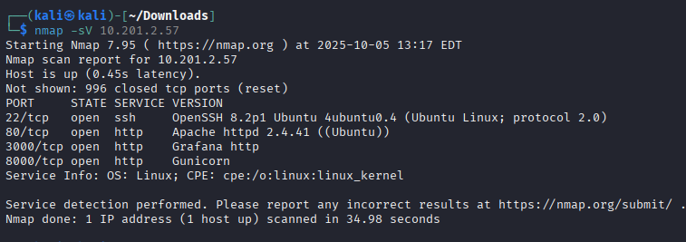
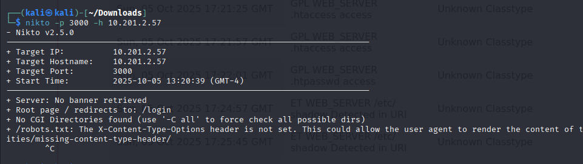
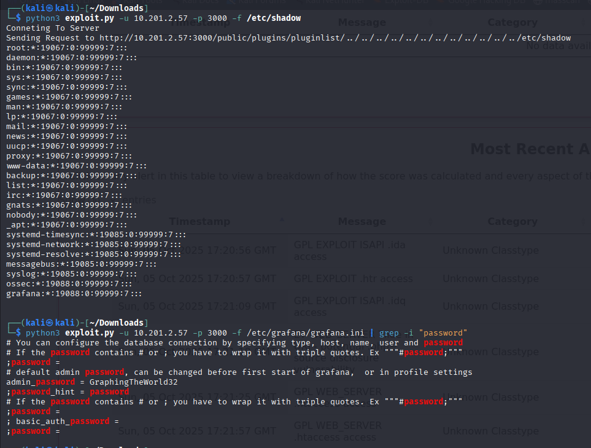
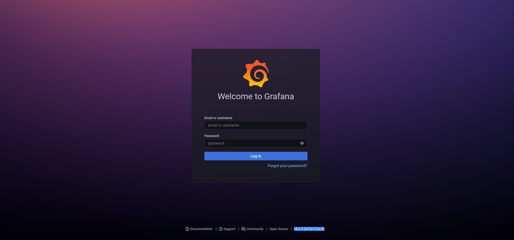
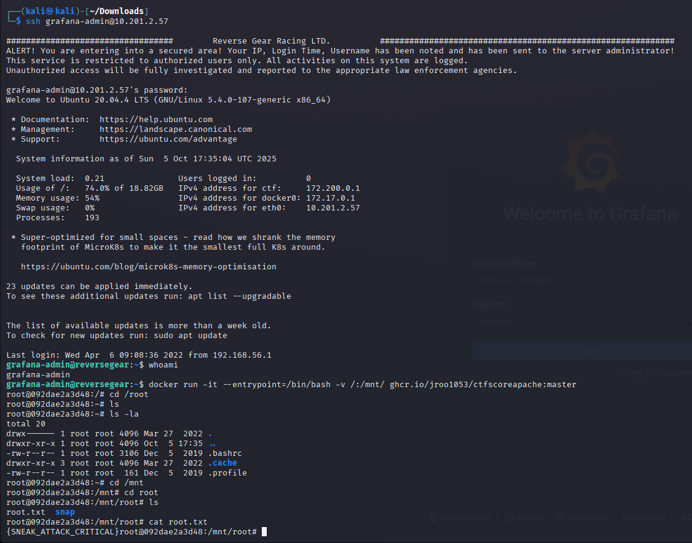
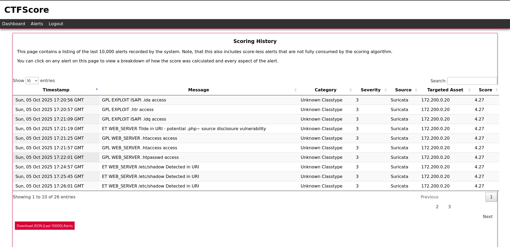
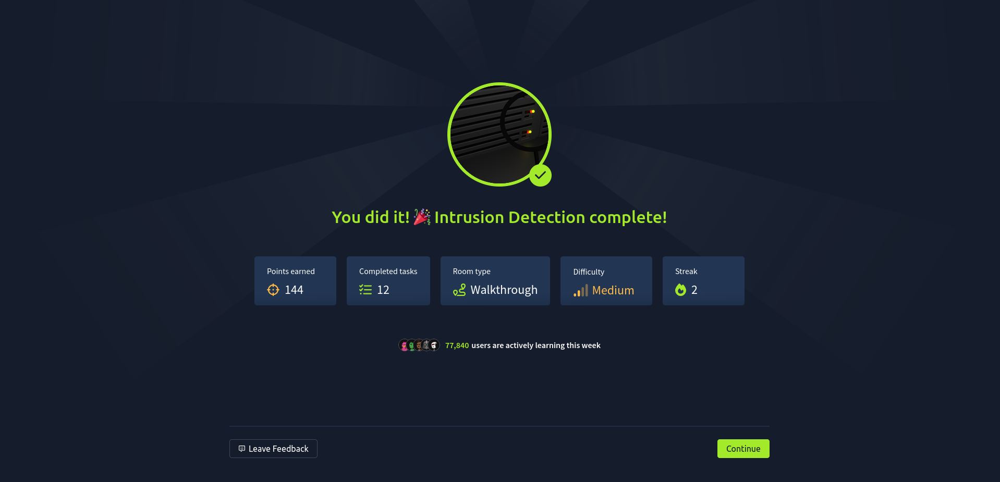

# TryHackMe — IDS Evasion Room Report

**Author:** DILSHAD AHAMMED  
**TryHackMe profile:** [https://tryhackme.com/p/DILSHADN](https://tryhackme.com/p/DILSHADN)  
**Room:** IDS Evasion ([https://tryhackme.com/room/idsevasion](https://tryhackme.com/room/idsevasion))

---

## Executive Summary

This report documents the steps taken to complete the TryHackMe "IDS Evasion" room. The objective was to bypass detection controls, exploit a vulnerable Grafana instance, obtain user-level and root-level flags, and explain the actions and outcomes. The exercise demonstrates common IDS/alert triggers, exploitation of misconfigurations, and privilege escalation using container traversal. Key results:

* Obtained Grafana credentials: `grafana-admin:GraphingTheWorld32`.
* Retrieved root flag: `{SNEAK_ATTACK_CRITICAL}`.

---

## Methodology & Steps

This section documents the actions in sequence: reconnaissance, vulnerability discovery, exploitation (credential extraction and web exploitation), and privilege escalation.

### 1. Reconnaissance / Port discovery

Initial scanning is used to find open ports and services. 


**Command (example):**

```
nmap -sV <MACHINE_IP>
```

*What happened:* The scan revealed a web service on port **3000** (Grafana) which warranted further probing.

---

### 2. Web enumeration / vuln scanning

A quick web-server-focused scan targeted port 3000 to discover possible vulnerabilities.

**Command used:**

```
nikto -p 3000 -h MACHINE_IP
```

**What happened:**

* Nikto flagged potential issues and endpoints on the Grafana instance.
* The findings suggested that files/configuration accessible via HTTP could be leaked or misconfigured, so further probing for file read endpoints was attempted.



---

### 3. Exploitation — remote file read to extract credentials

A custom exploit script (`exploit.py`) was used to fetch sensitive files exposed by the Grafana instance. The script supports a `-f` option to request arbitrary files from the remote server.

**Commands executed:**

```
python3 exploit.py -u MACHINE_IP -p 3000 -f /etc/shadow
python3 exploit.py -u MACHINE_IP -p 3000 -f /etc/grafana/grafana.ini
```

**What happened:**

* The `/etc/shadow` retrieval attempt confirms arbitrary file read capability (sensitive file was targeted).
* Retrieving `/etc/grafana/grafana.ini` succeeded and revealed Grafana admin credentials: `grafana-admin:GraphingTheWorld32`.



**Explanation:** The Grafana web service was vulnerable to an endpoint that allowed reading local files. By requesting the `grafana.ini` file, stored configuration values — including administrative credentials — were leaked.

---

### 4. Accessing Grafana and gaining initial shell

Using the credentials discovered in the previous step, an SSH session was established as the Grafana administrative user.

**Action (conceptual):**

* Log in to Grafana web UI using the leaked credentials.
* Use Grafana or exposed service features (for example, dashboard provisioning or plugin upload/downloading) to achieve code execution or a shell.



**What happened:**

* Authentication succeeded with `grafana-admin:GraphingTheWorld32`, giving administrative access to Grafana.

---

### 5. Privilege escalation to root

With an initial shell as the Grafana admin, the target contained Docker and privileged container access that could be abused to escalate to root.

**Command used (local container trick):**

```
docker run -it --entrypoint=/bin/bash -v /:/mnt/ ghcr.io/jroo1053/ctfscoreapache:master
```

**What happened:**

* The attacker launched a Docker container and bind-mounted the host filesystem into the container at `/mnt`. This allowed traversal of the host filesystem from within the container.
* From the container shell, it was possible to access sensitive host files and escalate privileges to root (common in CTF contexts where docker is misconfigured and the user can run containers with host mounts).
* The root flag `{SNEAK_ATTACK_CRITICAL}` was located and retrieved.



**Explanation:** Mounting the host filesystem into a container provides direct access to host files. If the container runs with enough capabilities, it can be used to manipulate host files or spawn processes that ultimately yield root access. In this room, that technique was intentionally available to teach container breakout concepts.

---

## IDS / Alerts Observed

* The room includes Wazuh/IDS alerts to demonstrate detection.
* Actions such as file reads from `/etc/` and unexpected dashboard actions typically generate IDS alerts. These alerts show the value of monitoring and the specific signatures triggered by reconnaissance and exploitation.



---

## Recommendations (operational security)

1. **Harden web applications**: Prevent arbitrary file read endpoints; validate and sanitize input; restrict file-system access.
2. **Protect configuration files**: Ensure config files with credentials are not served or stored in publicly readable locations.
3. **Container hygiene**: Avoid mounting the host filesystem into containers; run containers with least privilege; restrict runtime capabilities.
4. **Secrets management**: Use vaults or secret stores instead of plaintext credentials in config files.
5. **Monitoring & alerting**: Correlate web server logs, filesystem access, and IDS alerts to rapidly detect suspicious file reads.

---

## Conclusion

The IDS Evasion room demonstrates a realistic attack chain: recon → infoleak (local file read) → credential compromise → initial access → container-based privilege escalation. The exercise reinforces how misconfigurations (exposed services and mount privileges) and leaked credentials lead to full system compromise. The provided screenshots document the key steps and outcomes.

---



---
