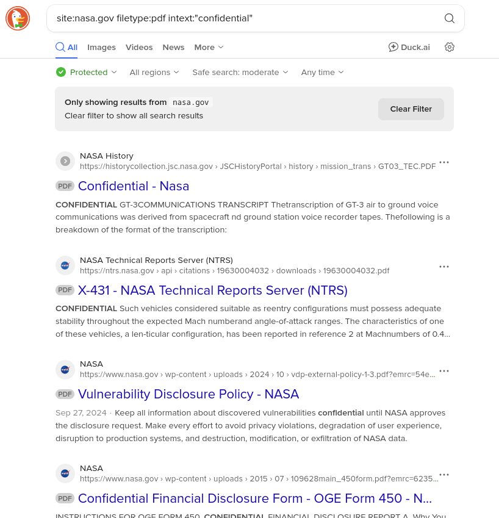
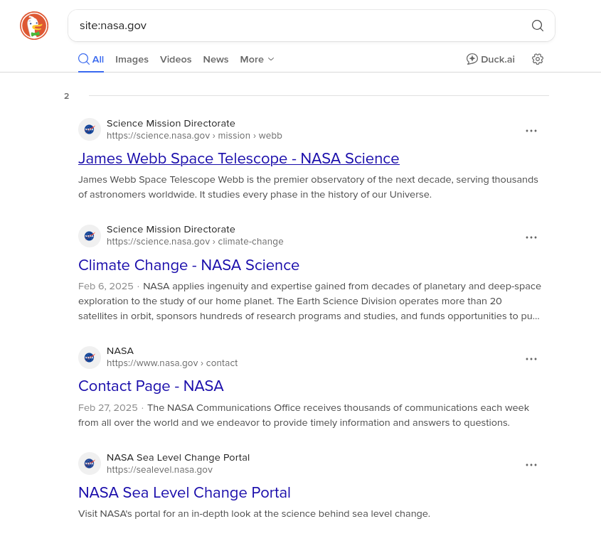
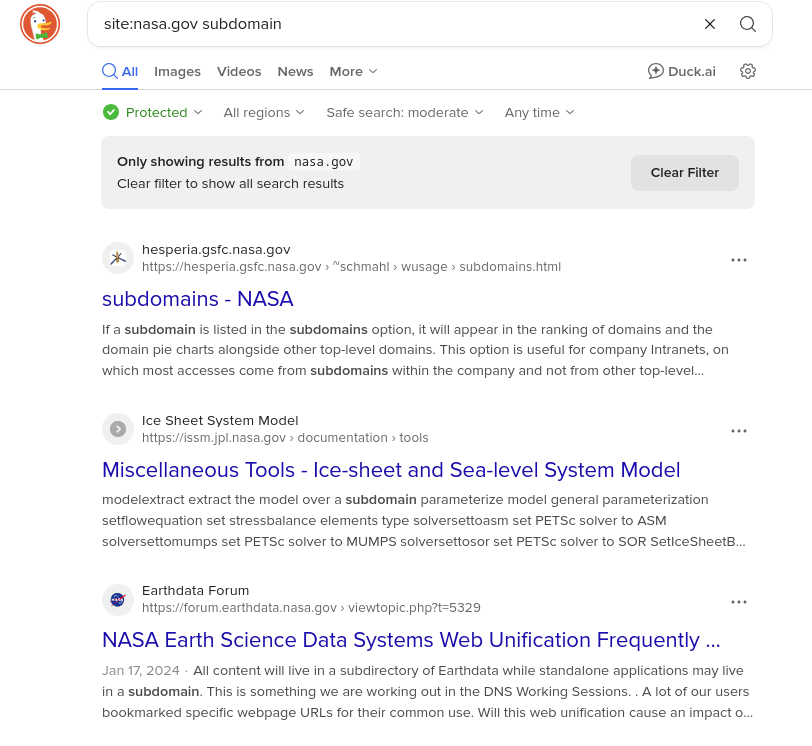

# Task 2 - Google Dorking
---

## File Search

Payload 1 : `site:nasa.gov filetype:pdf intext:"confidential"`

  

Found:

- File 1 : [COMPOSITE AIR-TO-GROUND AND ONBOARD VOICE TAPE TRANSCRIPTION OF THE GT-3 MISSION](https://historycollection.jsc.nasa.gov/JSCHistoryPortal/history/mission_trans/GT03_TEC.PDF)
- File 2 : [Technical Memorandum X-431](https://ntrs.nasa.gov/api/citations/19630004032/downloads/19630004032.pdf)

## Subdomain Enumeration

Payload 1 : `site:nasa.gov`

  

Payload 2 : `site:nasa.gov subdomain`

  

Found:
- science.nasa.gov
- eyes.nasa.gov
- sealevel.nasa.gov
- code.nasa.gov
- images.nasa.gov
- worldview.earthdata.nasa.gov

