# Task 3 - Nmap


### Introduction

Whenever your computer connects to the internet—like loading a website or checking email—it uses something called **network ports**. These ports act like channels that let multiple connections happen at once without confusion. For example, if you have several browser tabs open, your computer uses different local ports to keep track of each one separately.

Servers use ports too. Different services (like HTTP and HTTPS) listen on specific ports—usually port 80 for HTTP and port 443 for HTTPS—so they know what kind of traffic is coming in. A typical connection happens between a random port on your computer and a specific port on the server, making it possible to run and access multiple services smoothly at the same time.

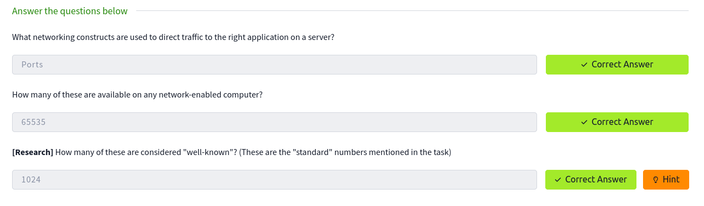

### Nmap Switches

Nmap can be accessed by typing `nmap` into the terminal command line, followed by some of the "switches" (command arguments which tell a program to do different things).

- **`-sS`** — SYN (half-open / stealth) scan  
- **`-sU`** — UDP scan  
- **`-O`** — Operating System detection  
- **`-sV`** — Service version detection  
- **`-v`, `-vv`** — Increase verbosity levels  
- **`-oA`, `-oN`, `-oG`** — Save output in all formats, normal format, or grepable format, respectively  
- **`-A`** — Aggressive mode (enables OS, version detection, scripts + traceroute)  
- **`-T5`** — Timing template level 5 (fast, noisy)  
- **`-p-`** — Scan all ports  
- **`--script`** and **`--script=vuln`** — Run single or all scripts in the “vuln” category

### Scan Types

#### Overview

When port scanning with Nmap, there are three basic scan types. These are:

- TCP Connect Scans (`-sT`)
- SYN "Half-open" Scans (`-sS`)
- UDP Scans (`-sU`)

Additionally there are several less common port scan types, some of which we will also cover (albeit in less detail). These are:

- TCP Null Scans (`-sN`)
- TCP FIN Scans (`-sF`)
- TCP Xmas Scans (`-sX`)

#### TCP Connect Scans - (`-sT`)

**Three way handshake:**
The three-way handshake consists of three stages. First the connecting terminal (our attacking machine, in this instance) sends a TCP request to the target server with the SYN flag set. The server then acknowledges this packet with a TCP response containing the SYN flag, as well as the ACK flag. Finally, our terminal completes the handshake by sending a TCP request with the ACK flag set.

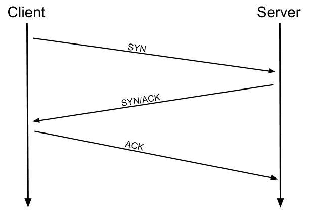

For example, if a port is closed, [RFC 9293](https://datatracker.ietf.org/doc/html/rfc9293) states that:

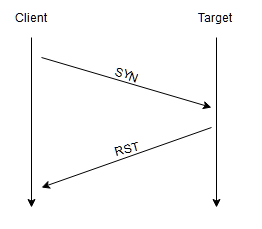

Many firewalls are configured to simply drop incoming packets. Nmap sends a TCP SYN request, and receives nothing back. This indicates that the port is being protected by a firewall and thus the port is considered to be _filtered_.

It is very easy to configure a firewall to respond with a RST TCP packet. For example, in IPtables for Linux, a simple version of the command would be as follows:

`iptables -I INPUT -p tcp --dport <port> -j REJECT --reject-with tcp-reset`

This can make it extremely difficult (if not impossible) to get an accurate reading of the target(s).

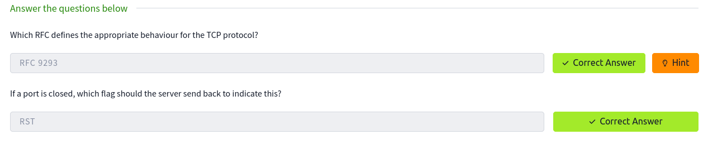

#### SYN Scans - (`-sS`)

SYN scans sends back a RST TCP packet after receiving a SYN/ACK from the server (this prevents the server from repeatedly trying to make the request). SYN scans are sometimes referred to as "_Half-open"_ scans, or _"Stealth"_ scans.

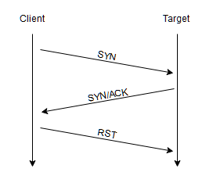

SYN scans are the default scans used by Nmap _if run with sudo permissions_. If run without sudo permissions, Nmap defaults to the TCP Connect scan.

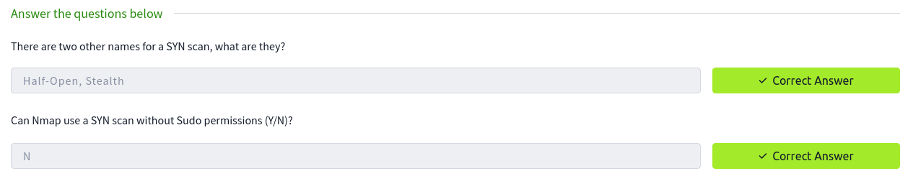

#### UDP Scans - (`-sU`)

Unlike TCP, UDP is stateless, meaning it doesn’t establish a connection before sending data—it just sends packets and hopes they arrive. This makes UDP fast and ideal for things like video streaming, but harder to scan.

When using Nmap with the `-sU` option for a UDP scan, an open port usually gives no response, so Nmap labels it as open|filtered. If Nmap receives a UDP reply (rare), the port is marked open. A closed port typically replies with an ICMP message saying it's unreachable, which Nmap uses to mark the port as closed.

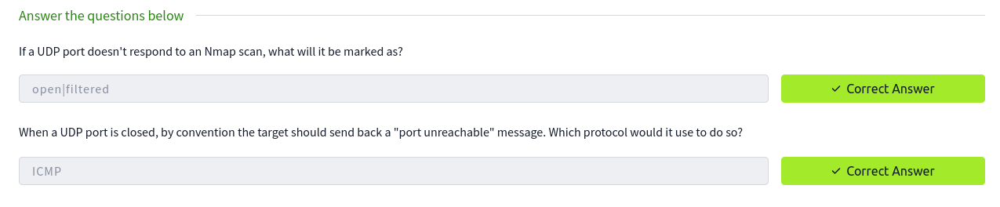

#### NULL, FIN and Xmas

NULL, FIN and Xmas TCP port scans are less commonly used. All three are interlinked and are used primarily as they tend to be even stealthier, relatively speaking, than a SYN "stealth" scan.

**NULL:**

As the name suggests, NULL scans (`-sN`) are when the TCP request is sent with no flags set at all. As per the RFC, the target host should respond with a RST if the port is closed.

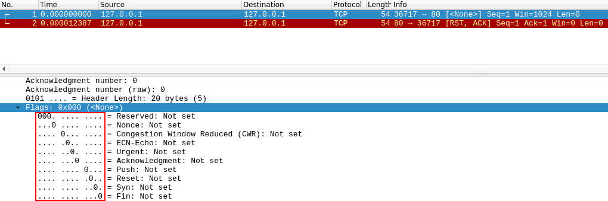

**FIN:**

FIN scans (`-sF`) work in an almost identical fashion; however, instead of sending a completely empty packet, a request is sent with the FIN flag (usually used to gracefully close an active connection). Nmap expects a RST if the port is closed.

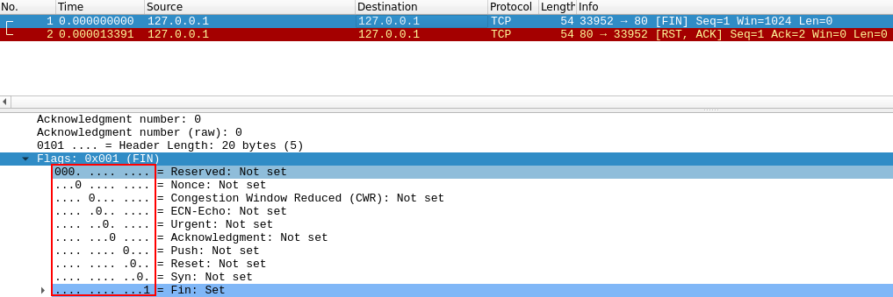

**XMAS**

As with the other two scans in this class, Xmas scans (`-sX`) send a malformed TCP packet and expects a RST response for closed ports. It's referred to as an xmas scan as the flags that it sets (PSH, URG and FIN) give it the appearance of a blinking christmas tree when viewed as a packet capture in Wireshark.

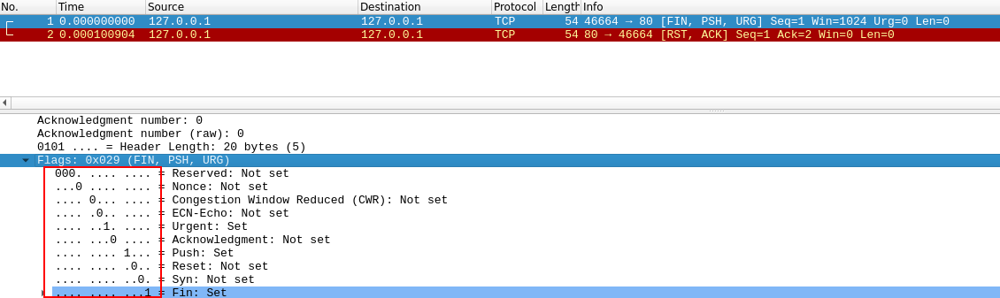


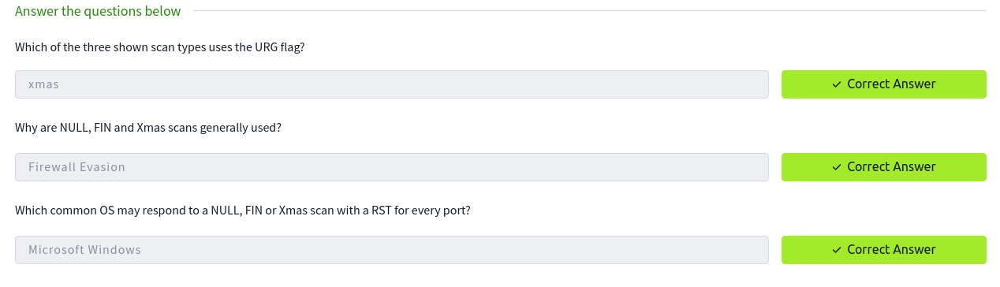

#### ICMP Network Scanning

When you first hit a target network in a black‑box test, your immediate goal is to map which IPs have live hosts. A quick way to do that is an Nmap **ping sweep**: Nmap sends ICMP “pings” across a range of addresses and marks the ones that reply as alive. It’s a fast way to build a baseline of active hosts—though it isn’t perfect (some hosts block or ignore pings), so treat the results as a starting point, not the final word.

To perform a ping sweep, we use the `-sn` switch in conjunction with IP ranges which can be specified with either a hypen (`-`) or CIDR notation. i.e. we could scan the `192.168.0.x` network using:

- `nmap -sn 192.168.0.1-254`
or
- `nmap -sn 192.168.0.0/24`

The `-sn` switch tells Nmap not to scan any ports -- forcing it to rely primarily on ICMP echo packets (or ARP requests on a local network, if run with sudo or directly as the root user) to identify targets. In addition to the ICMP echo requests, the `-sn` switch will also cause nmap to send a TCP SYN packet to port 443 of the target, as well as a TCP ACK (or TCP SYN if not run as root) packet to port 80 of the target.

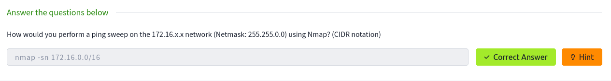

### NSE Scripts

#### Overview

The **N**map **S**cripting **E**ngine (NSE) is an incredibly powerful addition to Nmap, extending its functionality quite considerably. NSE Scripts are written in the _Lua_ programming language, and can be used to do a variety of things: from scanning for vulnerabilities, to automating exploits for them.

There are many categories available. Some useful categories include:

- `safe`:- Won't affect the target
- `intrusive`:- Not safe: likely to affect the target  
- `vuln`:- Scan for vulnerabilities
- `exploit`:- Attempt to exploit a vulnerability
- `auth`:- Attempt to bypass authentication for running services (e.g. Log into an FTP server anonymously)
- `brute`:- Attempt to bruteforce credentials for running services
- `discovery`:- Attempt to query running services for further information about the network (e.g. query an SNMP server).

A more exhaustive list can be found [here](https://nmap.org/book/nse-usage.html).

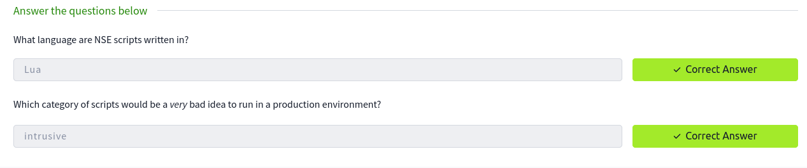

#### Working with the NSE

Nmap’s `--script` switch runs NSE scripts by category or name (e.g. `--script=vuln` or `--script=safe`). To run a specific script use `--script=<name>` (e.g. `--script=http-fileupload-exploiter`), and run multiple scripts by separating names with commas: `--script=smb-enum-users,smb-enum-shares`.  
Scripts that need parameters use `--script-args` with comma-separated `script.argument=value` pairs — for example:

```bash
nmap -p 80 --script http-put --script-args http-put.url='/dav/shell.php',http-put.file='./shell.php'
```

Get per-script help with `nmap --script-help <script-name>`.

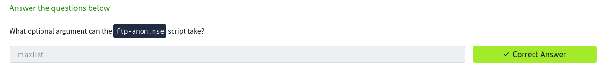

#### Searching for Scripts

There are two ways to search for installed scripts. One is by using the `/usr/share/nmap/scripts/script.db` file. Despite the extension, this isn't actually a database so much as a formatted text file containing filenames and categories for each available script.

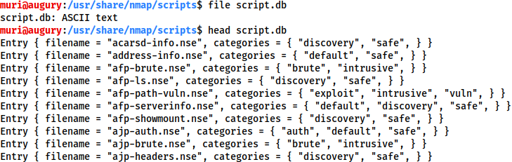

The second way to search for scripts is quite simply to use the `ls` command. For example, we could get the same results as in the previous screenshot by using `ls -l /usr/share/nmap/scripts/*ftp*`:

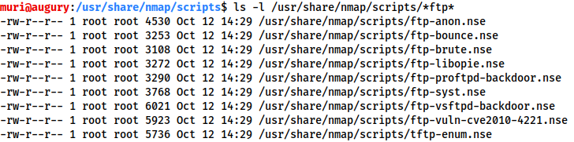


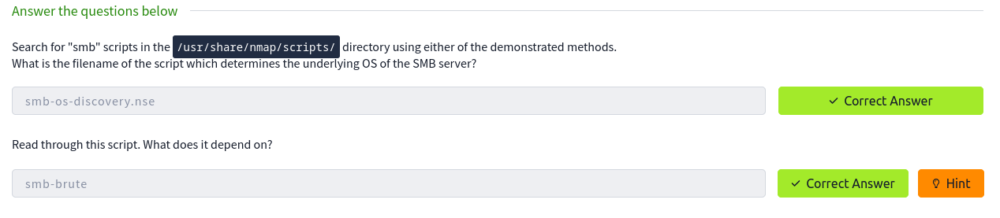

### Firewall Evasion

Many Windows hosts block ICMP by default, so Nmap’s default ping can miss them and mark them “down.” Use `-Pn` to skip host discovery and force Nmap to treat targets as alive (slower if the host is actually offline). If you’re on the same LAN, Nmap can also use ARP to detect hosts.

Other useful firewall‑evasion switches: `-f` (fragment packets), `--mtu <size>` (control fragment size), `--scan-delay <time>` (pace packets to avoid rate‑based detections), and `--badsum` (send packets with bad checksums to probe for firewalls/IDS that respond without validating).

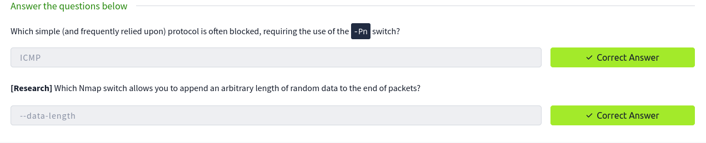

### Practical

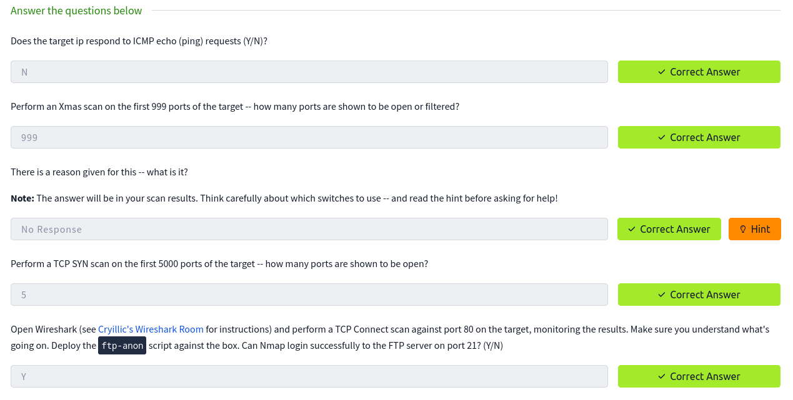

### Conclusion

Key takeaways include network mapping with ping sweeps, the difference between stateful TCP and stateless UDP scanning (`-sU`), and how to interpret `open`, `closed`, and `open|filtered` UDP results. NSE usage was covered — running scripts by category or name, supplying script-specific arguments with `--script-args`, and consulting `--script-help` for details.  
Defensive workarounds were also explored: skipping ICMP discovery with `-Pn`, using ARP on local networks, and employing evasion options such as `-f`/`--mtu`, `--scan-delay`, and `--badsum`. Hands‑on practice with these tools helped solidify the concepts.

