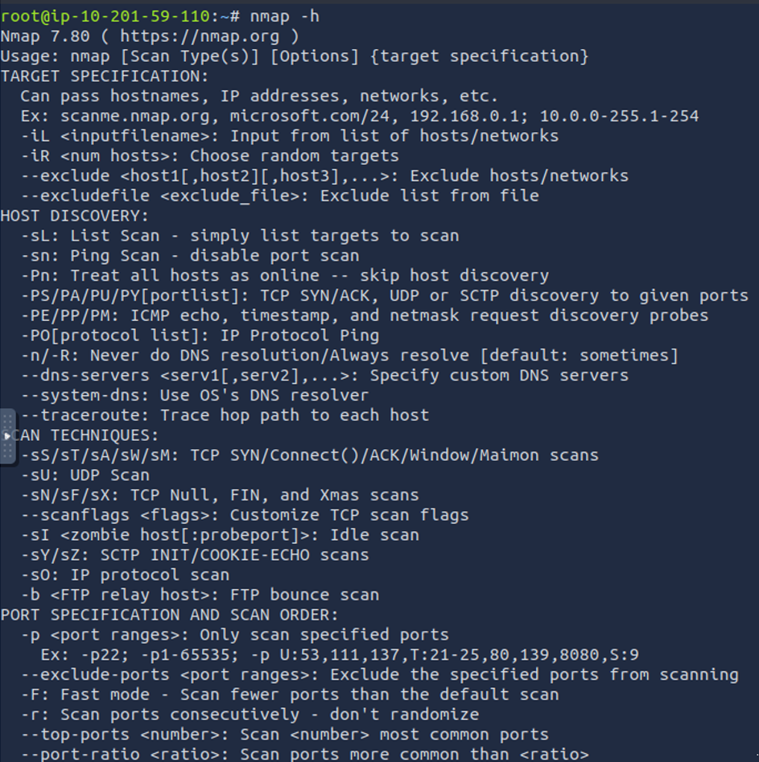

# 🌐 TryHackMe – Nmap Writeup

## 🔍 Challenge Overview

* **Room Name:** Nmap
* **Platform:** TryHackMe
* **Difficulty:** Easy
* **Objective:** An in depth look at scanning with Nmap, a powerful network scanning tool.
* **Room Link:** [https://tryhackme.com/room/furthernmap](https://tryhackme.com/room/furthernmap)

---
Nmap (Network Mapper) is a powerful and widely used open-source tool for network discovery and security auditing. It enables security professionals and system administrators to identify hosts on a network, discover open ports and services, determine operating systems, and detect potential vulnerabilities. Nmap supports various scanning techniques such as TCP connect, SYN scans, UDP scans, and more advanced options like service version detection and NSE (Nmap Scripting Engine) for automation. Due to its flexibility, speed, and detailed output, Nmap is considered an essential tool in the cybersecurity toolkit, especially in tasks like penetration testing, vulnerability assessment, and network troubleshooting.

**Task 2: Introduction**

1. What networking constructs are used to direct traffic to the right application on a server?

ANS: Ports

2. How many of these are available on any network-enabled computer?

ANS: 65535

3. How many of these are considered "well-known"?

ANS: 1024

---

---
**Task 3: Nmap Switches**

1. What is the first switch listed in the help menu for a syn scan?

ANS:-sS

2. Which switch would you use for a udp scan?

ANS: -SU

3. If you wanted to detect which operating system the target is running on, which switch would you use?

ANS: -O

4. Nmap provides a switch to detect the version of the services running on the target. What is this switch?

ANS: -SV

5. The default output provided by nmap often does not provide enough information for a pentester. How would you increase the verbosity?

ANS: -v

6. Verbosity level one is good, but verbosity level two is better! How would you set the verbosity level to two?

ANS: -vv

7. What switch would you use to save the nmap results in three major formats?

ANS: -oA

8. What switch would you use to save the nmap results in a "normal" format?

ANS: -oN

9. A very useful output format: how would you save results in a "grepable" format?

ANS: -oG

10. How would you activate this setting?

ANS: -A

11. How would you set the timing template to level 5?

ANS: -T5

12. How would you tell nmap to only scan port 80?

ANS: -p 80

13. How would you tell nmap to scan ports 1000-1500?

ANS: -p 1000-1500

14. How would you tell nmap to scan all ports?

ANS: -p-

15. How would you activate a script from the nmap scripting library (lots more on this later!)?

ANS: --script

16. How would you activate all of the scripts in the "vuln" category?

ANS: --script vuln

---

**Task 5: TCP Connect Scans**

1. Which RFC defines the appropriate behavior for the TCP protocol?

Ans: RFC 9293

2. If a port is closed, which flag should the server send back to indicate this?

Ans: RST

---

**Task 6: SYN Scans**

1. There are two other names for a SYN scan. What are they?

Ans: Half-open, Stealth

2. Can Nmap use a SYN scan without Sudo permissions (Y/N)?

Ans: N

---

**Task 7: UDP Scans**

1. If a UDP port doesn't respond to an Nmap scan, what will it be marked as?

Ans: open|filtered

2. When a UDP port is closed, by convention the target should send back a "port unreachable" message. Which protocol would it use to do so?

Ans: ICMP

---

**Task 8: NULL, FIN and Xmas Scans**

1. Which of the three scan types uses the URG flag?

Ans: Xmas

2. Why are NULL, FIN, and Xmas scans generally used?

Ans: Firewall evasion

3. Which common OS may respond to a NULL, FIN, or Xmas scan with a RST for every port?

Ans: Microsoft Windows

---

**Task 9: ICMP Network Scanning**

1. How would you perform a ping sweep on the 172.16.x.x network (Netmask: 255.255.0.0) using Nmap (CIDR notation)?

Ans: nmap -sn 172.16.0.0/16

---

**Task 10: NSE Scripts Overview**

1. What language are NSE scripts written in?

Ans: Lua

2. Which category of scripts would be a very bad idea to run in a production environment?

Ans: Intrusive

---

**Task 11: Working with the NSE**

1. What optional argument can the ftp-anon.nse script take?

Ans: maxlist

---

**Task 12: Searching for Scripts**

1. What is the filename of the script which determines the underlying OS of the SMB server?

Ans: smb-os-discovery.nse

2. What does the smb-os-discovery.nse script depend on?

Ans: smb-brute

---

**Task 13: Firewall Evasion**

1. Which simple (and frequently relied upon) protocol is often blocked, requiring the use of the -Pn switch?

Ans: ICMP

2. Which Nmap switch allows you to append an arbitrary length of random data to the end of packets?

Ans: --data-length

---

**Task 14: Practical**

1. Does the target respond to ICMP (ping) requests (Y/N)?

Ans: N

2. Perform an Xmas scan on the first 999 ports of the target - how many ports are shown to be open or filtered?

Ans: 999

3. What is the reason for the above result?

Ans: No response

4. Perform a TCP SYN scan on the first 5000 ports of the target - how many ports are shown to be open?

Ans: 5

5. Deploy the ftp-anon script against the box. Can Nmap login successfully to the FTP server on port 21 (Y/N)?

Ans: Y

---